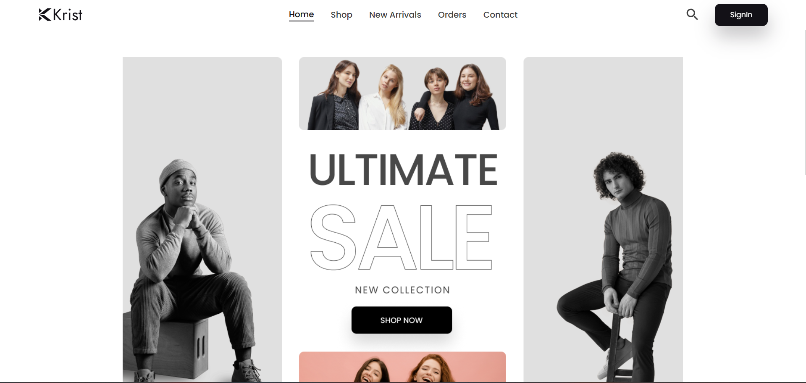
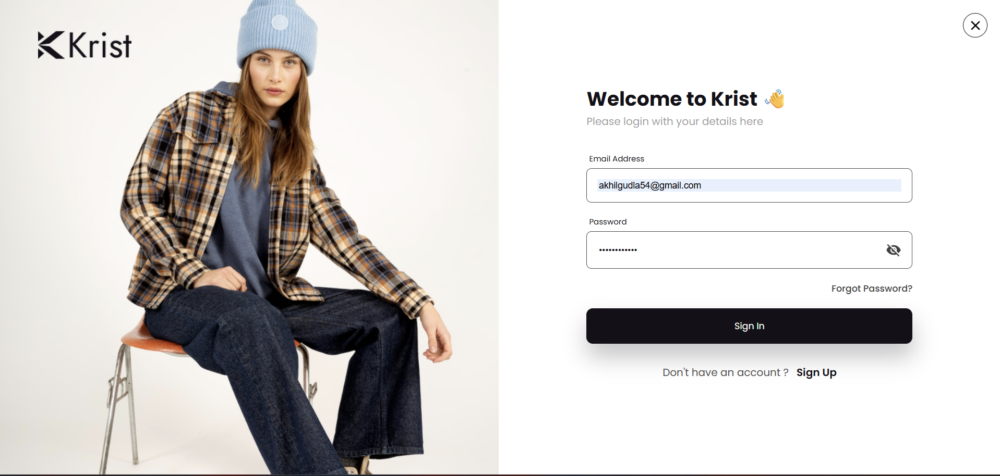

# 🛒 MERN Ecommerce Website

A full-stack Ecommerce web application built using the **MERN Stack (MongoDB, Express, React, Node.js)**. This project demonstrates user authentication, product management, cart functionality, and a responsive UI.

---

## 🚀 Features

* 🔐 User Authentication (Sign Up / Login)
* 🛍️ Product Listing & Categories
* 🛒 Add to Cart functionality
* ❤️ Wishlist / Favorites
* 📦 Product Details Page
* 🔄 State Management using Redux
* 🌐 REST API integration
* 🎨 Responsive UI with modern design

---

## 🛠️ Tech Stack

**Frontend:**

* React.js
* Redux Toolkit
* Material UI

**Backend:**

* Node.js
* Express.js

**Database:**

* MongoDB Atlas

---

## 📂 Project Structure

```
Ecommerce-Website/
│── client/     # React Frontend
│── server/     # Node.js Backend
│── README.md
```

---

## ⚙️ Installation & Setup

### 1️⃣ Clone the repository

```
git clone https://github.com/akhilsai82/E-commerece.git
cd E-commerece
```

---

### 2️⃣ Install dependencies

**For backend:**

```
cd server
npm install
```

**For frontend:**

```
cd client
npm install
```

---

### 3️⃣ Setup Environment Variables

Create a `.env` file in the `server` folder:

```
MONGO_DB=your_mongodb_connection_string
JWT_SECRET=your_secret_key
```

---

### 4️⃣ Run the project

**Start backend:**

```
cd server
npm start
```

**Start frontend:**

```
cd client
npm start
```

---

## 🌐 Screenshots

### 🏠 Home Page



### 🔐 Login Page



---

## 📌 Future Improvements

* 💳 Payment Gateway Integration
* 📦 Order Tracking
* 🧑‍💼 Admin Dashboard
* 📊 Analytics Dashboard

---

## 👨‍💻 Author

**Akhil Sai**

* GitHub: https://github.com/akhilsai82

---

## ⭐ If you like this project

Give it a ⭐ on GitHub!
